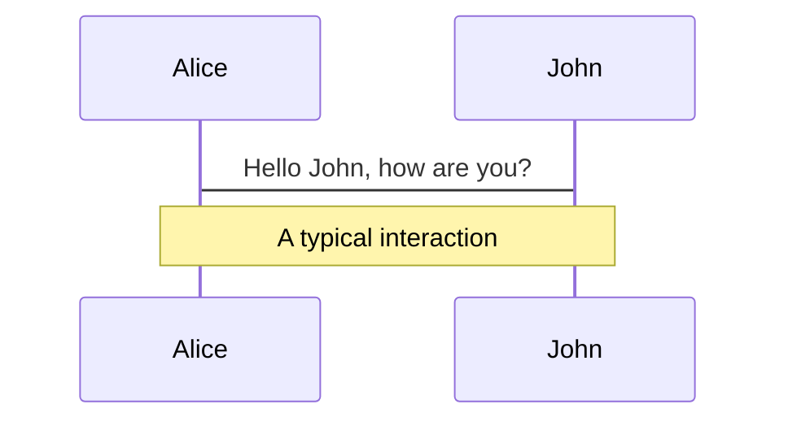
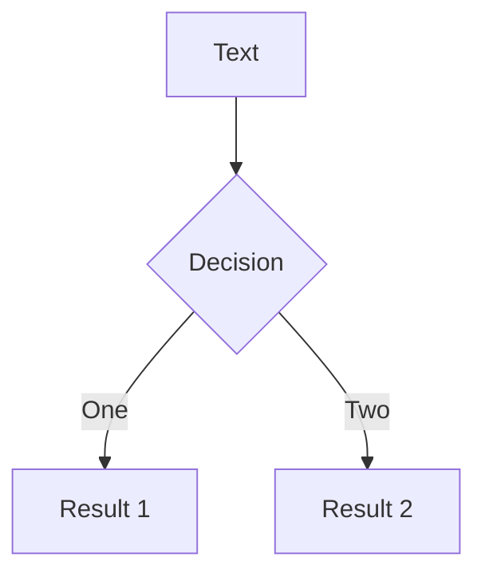

# Online Tech Talks

- Please mute your mic
- We will start in <iframe src="https://free.timeanddate.com/countdown/i8dwv0lq/n541/cf100/cm0/cu4/ct0/cs0/ca0/co0/cr0/ss0/cac000/cpc000/pcfff/tcfff/fs100/szw320/szh135/iso2022-06-24T17:05:00" allowtransparency="true" frameborder="0" width="320" height="135" style="margin-left:260px;margin-top:-10px;"></iframe>

<iframe width="100" height="100" src="https://www.youtube.com/embed/VBlFHuCzPgY?autoplay=1" title="Elevator Music - 1 hour" frameborder="0" allow="accelerometer; autoplay; clipboard-write; encrypted-media; gyroscope; picture-in-picture" allowfullscreen></iframe>

<!--
DFDFDF
-->

---

# What are the OTT (Online Tech Talks)

A space to share stuff with other TMs

  

- 🤹 **Storytime** : something that was done during the week or the week before

  - I had to do this, I did it this way, and this is the result

   

- 🧑‍💻 **Research/Blog Post Presentation** - theme can be shared and used with npm packages\

  - Get online to present the research or Blog Post made

   

- 🛠 **Technology updates** - : New features / Frameworks / Tools

<!--
You can have `style` tag in markdown to override the style for the current page.
Learn more: https://sli.dev/guide/syntax#embedded-styles
-->

---

# Graphs

Why devs do not like them:

  

- Very handmade

  - Lots of mouse ussage in building them

   

- Hard to maintain

   

- 🛠 **Extra software needed**

---

# MermaidJS

You can create diagrams / graphs from textual descriptions, directly in your Markdown.

  

